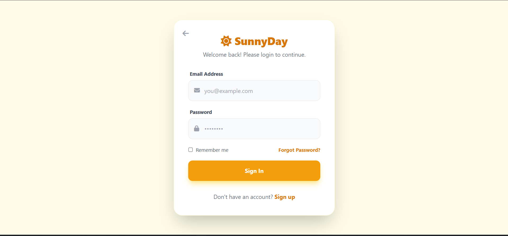
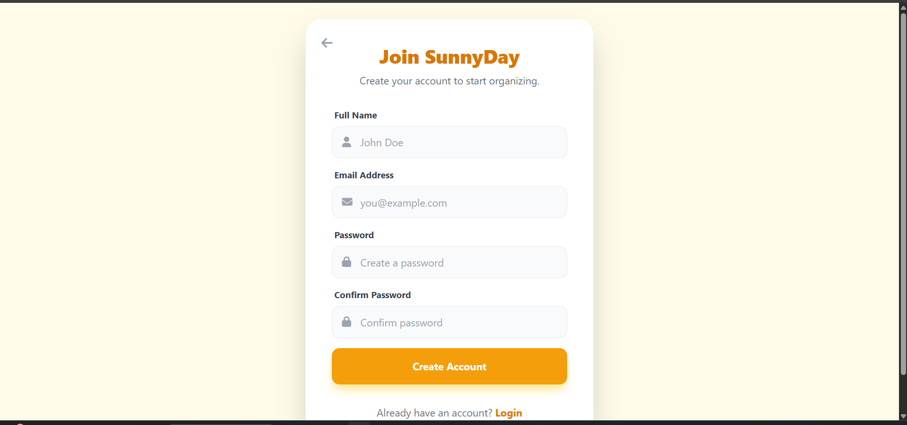
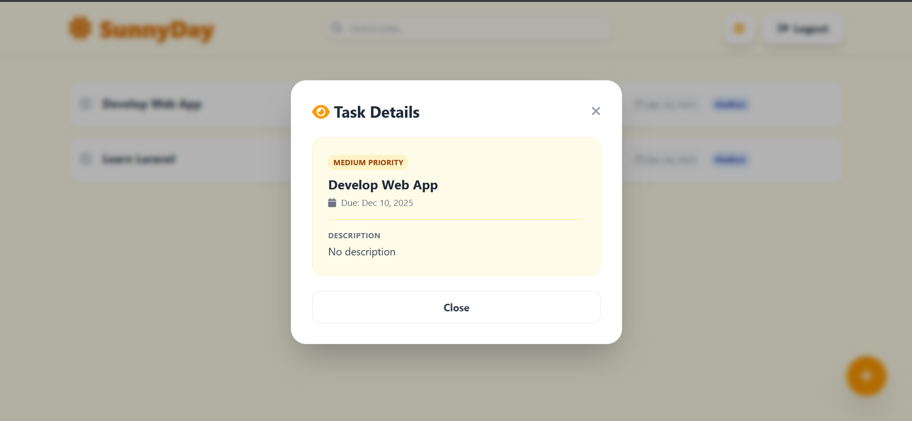
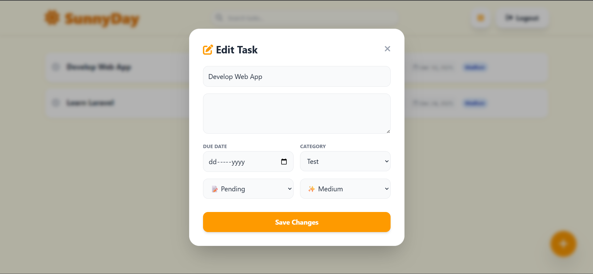
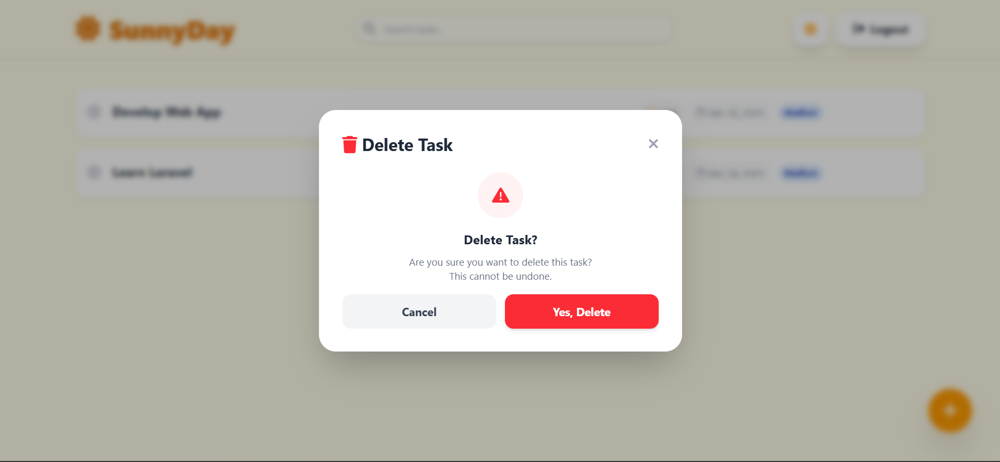
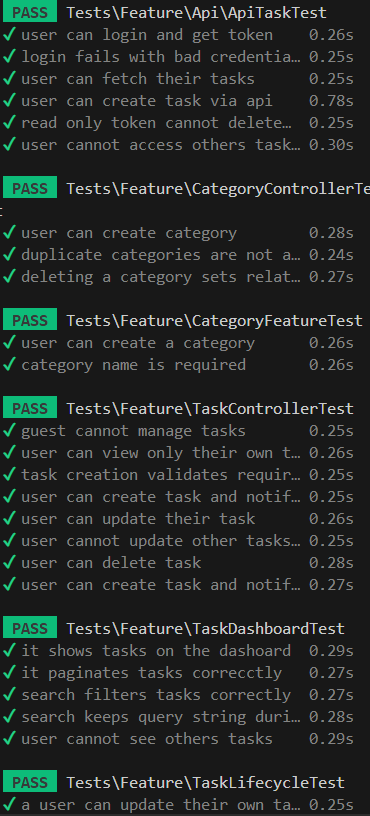
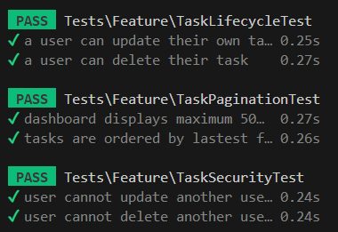

# ☀️ SunnyDay - Task Manager Application

## Contributor

**Nguyen Huu Huy Anh - 21CSE - 21020004**

## User Interface

1. **Homepage (Grid view)**
   

2. **Homepage (List view)**
   

3. **Login**
   

4. **Register**
   

5. **New Task**
   

6. **New Category**
   

7. **View Task**
   

8. **Edit Task**
   

9. **Delete Task**
   

10. **404 Page**
    

## Website Overview

This project is a robust Task Management System built with **Laravel**. It allows users to organize their workflow by creating, updating, deleting and make category for tasks. The application ensures data security through user authentication and authorization, ensuring users can only manage their own tasks.

### Key Features

-   **User Authentication**: Secure registration and login (Laravel Auth).
-   **Task Manager (CRUD)**:
    -   Create tasks with Title, Description (optional), Status, Priority, and Due Date (optional).
    -   View a list of tasks with status indicators (Pending/Completed).
    -   Edit tasks details and update progress.
    -   Delete tasks.
-   **Categorization**: Each tasks can be assigned to a specific category (Ex: Work, School) or left uncategorized.
-   **Authorization**: Strict policy enforcement prevents users from accessing or modifying other user's data.
-   **Swappable View**: The tasks can be displayed with either list or grid views.

## Technology Stack

### Backend

-   **Laravel**: Open-source web framework for building web application.
-   **PHP**: Open-source, server side, HTML embedded scripting language used to create dynamic web page.
-   **Scramble**: OpenAPI (Swagger) documentation generator for Laravel
-   **Pulse**: Free, open-source, first-party package that provides a dashboard for real-time performance monitoring and insights into your Laravel application's usage and bottlenecks.
-   **Sanctum**: A lightweight authentication system designed for Single Page Applications (SPAs), mobile applications, and simple token-based APIs.
-   **Slack Notification**: Provides support for sending notifications across a variety of delivery channels, including email, SMS (via Vonage, formerly known as Nexmo), and Slack.
-   **Telescope**: An elegant debug assistant for the Laravel framework that provides comprehensive, real-time insights into the operations of your application during local development.
-   **Tinker**: A powerful, interactive command-line tool known as a REPL (Read-Eval-Print Loop) that allows you to interact with your entire Laravel application directly from the terminal
-   **Sentry**: Provides comprehensive error and performance monitoring for Laravel applications

### Frontend

-   **Tailwind CSS/Vite**: Is the most seamless way to integrate it with frameworks like Laravel.
-   **Autoprefixer**: A PostCSS plugin that automatically adds necessary vendor prefixes and older display properties to your CSS, ensuring your modern code works across different browsers without you manually writing them.
-   **Axios**: A popular Promise-based HTTP client library for JavaScript.
-   **Concurrently**: An npm package used to run multiple npm scripts or general commands simultaneously.
-   **Laravel Vite plugin**: Providing a seamless integration between the Laravel backend and the Vite frontend build tool.
-   **PostCSS**: A powerful tool that transforms CSS styles using JavaScript plugins.
-   **Tailwind CSS**: A utility-first CSS framework packed with classes.
-   **Vite**: Vite is a blazing fast frontend build tool powering the next generation of web applications.

### Testing

-   **Framework**: PHPUnit (integrated with Laravel).
-   **Factories**: Faker library used to generate realistic test data.

### Database

-   **sqlite**: a C-language library that implements a small, fast, self-contained, high-reliability, full-featured, SQL database engine.
-   **Eloquent ORM**: Laravel's built-in tool that provides an elegant, Active Record implementation for interacting with a database using a simple, expressive PHP syntax instead of writing raw SQL queries.
-   **Database Indexing**: Optimized and faster query operations.

## Database Schema

The application uses a relational database design with three core tables.

`users`

-   `id` (Primary Key)
-   `name`,`email`,`password`
-   `timestamps`

`categories`

-   `id` (Primary Key)
-   `name` (String)
-   `user_id` (Foregin Key -> users)
-   `timestamps`

`tasks`

-   `id` (Primary Key)
-   `title` (String)
-   `description` (Text, Nullable)
-   `status` (Enum: 'pending', 'completed')
-   `priority` (Enum: 'low', 'medium', 'high)
-   `due_date` (Date, Nullable, Cast to Carbon Instance)
-   `user_id` (Foregin Key -> users)
-   `category_id` (Foregin Key -> categories, Nullable)
-   `timestamps`

## Testing Report

I have implemented a comprehensive automated testing for unit tests and feature tests to ensure reliability and security without failed.

**Unit Tests** (`tests/Unit/`)

Focused on Model logic and Database interactions.


**Feature Tests** (`tests/Feature/`)

Focused on User Actions, Controllers and Security.




**Total tests**: 34 passed ✅

**Duration**: 8.38s ⏳

## Setup & Installation

### Prerequisites

-   PHP 8.2+
-   Composer
-   Node.js & NPM (Optional, for building assets if not using CDN)

### Installation Steps

1. **Clone the repository**:

```Bash
git clone https://github.com/Anhnato/to-do-laravel.git
cd to-do-laravel
```

2. **Install PHP dependencies**

```Bash
composer install
```

3. **Environment Setup**

```Bash
cp .env.example .env
php artisan key:generate
```

4. **Database Migration**

```Bash
# Create the SQLite database file
touch database/database.sqlite

# Run migrations
php artisan migrate
```

5. **Run Test**

```Bash
php artisan test
```

6. **Start the Server**

```Bash
php artisan serve
```

Visit `http:localhost:8000` in your browser

## Key Optimizations

-   **In-Memory Testing Database:** Configured `phpunit.xml` to use `:memory:` SQLite. This allows the entire test suite to run in miliseconds by avoiding slow disk I/O operations.

    

-   **Factory Dependency Isolation:** Refactored `CategoryFactory` and `TaskFactory` to explicitly handle User generation. This prevents "N+1" creation loops and ensures `Foreign Key Integrity` violations do not occur during seed generation.

    

-   **Strict Type Casting:** Implemented Eloquent Casting (`$casts`) on the Task model. This automatically converts database timestamps into `Carbon` instances, preventing date-format errors in the UI and Controllers.

    

-   **Migration Order Strategy:** Renamed and reordered migration files (`Users` -> `Categories` -> `Tasks`) to ensure strict referential integrity. The database can now be wiped and rebuilt (`migrate:fresh`) without dependency errors.

    

-   **Mark `Notification` class as "Queueable"**: Implement Asynchronous Logic on Slack notification. If Slack is slow or down, when users create a task they can avoid staring at the loading spinner for 10 seconds.

    

-   **Server-Side Pagination:** Avoid Memory Bloat. If user has 5,000 tasks, instead of fetching 5,000 rows from SQL it only fetch the first 18 tasks and display the rest if user move to next page.

    

-   **Over-Fetching:** By default, Eloquent selects all columns (`SELECT *`). If user add a `description` column that contains huge paragraphs of text, but the "List View" only shows the `title` and `status`, we are wasting massive amounts of bandwidth carrying that description data around when it isn't needed so I make the system explicitly select only the columns user need for the list.

    

-   **Data Integrity:** When user delete category, the two database write operations sequentially.

1. Update Tasks (Set category to null).
2. Delete Category. Risk: If the server crashes or loses power specifically after step 1 but before step 2, the tasks are updated, but the category is **not deleted**. You now have "orphaned" data logic. We fix that by warpping multi-step database changes in a **Transaction**. This ensure "All or nothing".

    

## Prototype


